# 能源可信数据空间平台 · 系统详细操作流程

> 面向第一次拿到这套系统的使用者、评委与运维人员。**每一步都可以照着做**：菜单名、按钮名、字段名全部取自真实界面（`frontend/src/views/*.vue`、`router/index.js`），接口取自 `contract/API-CONTRACT.md` 与后端 `openapi.json`，截图来自真后端模式（`VITE_USE_MOCK=false`）的实际页面（1366×768）。
> 本手册所说的「当前已知差异」指截至 2026-08-22 联调时前端与真后端之间仍存在的行为差异，已记录在 `docs/agent-notes/MSG-ops-doc-to-integration-001.md`，修复后以界面为准。

目录

1. [系统概述与架构](#1-系统概述与架构)
2. [三种启动方式](#2-三种启动方式)
3. [登录与角色](#3-登录与角色)
4. [逐页操作说明](#4-逐页操作说明)
5. [15 分钟端到端演示剧本](#5-15-分钟端到端演示剧本)
6. [运维与排错](#6-运维与排错)
7. [附录](#7-附录)

---

## 1. 系统概述与架构

### 1.1 平台做什么

平台面向虚拟电厂「云—边—端」场景，把六个环节串成一条可信闭环：

```
身份接入(DID) → 数据登记与分级 → 权限授权 → 隐私计算(联邦学习+差分隐私) → 智能调度(DQN) → 存证审计(本地哈希链)
```

- 每个用户、设备、机构、边缘节点都有一个 DID（`did:vpp:<类型>:0x…`），签名算法 SM2，摘要 SM3，托管私钥用 SM4 加密。
- 每条数据资产登记时由算法服务自动分级（L1 公开 / L2 内部 / L3 敏感 / L4 核心），原始数据存 MySQL，链上只存 SM3 摘要。
- 权限是 RBAC 角色矩阵 + 按资源的授权记录，后端网关真正生效；越权与验签失败都会写高风险审计日志、自动上链并通过 WebSocket 推告警。
- 联邦学习：原始数据不出节点，只交换加了高斯噪声（差分隐私）并 Top-k 稀疏化的梯度，每轮梯度哈希上链。
- 调度：DQN 对每个节点给出 charge / idle / discharge 与功率，DeepSeek 生成中文解释（断网自动降级），签名下发后终端验签、执行、回执。
- 所有写操作都写入本地哈希链（`block_hash = SM3(prevHash + payloadHash + timestamp)`），可校验、可定位篡改点、可导出凭证。

### 1.2 服务拓扑与端口

```
浏览器 ──HTTP/WS──> frontend(nginx :80) ──/api/ /ws /health──> backend:8000 ──HTTP──> algo-service:8100
                                                                   ├──> mysql:3306
                                                                   └──> redis:6379
```

| 服务 | 容器名 | 端口 | 说明 |
|---|---|---|---|
| frontend | energy-tds-frontend | 宿主机 `FRONTEND_PORT`（默认 80）→ 容器 80 | Vue3 + Element Plus + ECharts，nginx 托管并反代 `/api/`、`/ws`、`/health` |
| backend | energy-tds-backend | 8000（仅容器网络） | FastAPI 安全内核（甲方）：认证、DID、密钥、资产、权限、存证、审计、节点、算法代理、WebSocket |
| algo-service | energy-tds-algo | 8100（仅容器网络） | FastAPI + NumPy：FedAvg/DP/Top-k、DQN、k-means 分级、风险评估、DeepSeek 三级降级 |
| mysql | energy-tds-mysql | 3306（仅容器网络） | MySQL 8.0，首次启动自动执行 `backend/sql/01_schema.sql`、`02_seed.sql` |
| redis | energy-tds-redis | 6379（仅容器网络） | 缓存、登录失败计数、风控滑动窗口、篡改演示备份 |

开发模式下各服务直接跑在本机：前端 Vite 5173（本联调环境用 5199）、backend 8000、algo 8100、MariaDB/MySQL 3306、Redis 6379。

**前端永远不直接调用 algo-service**，所有算法调用经过 backend 统一鉴权、审计、存证。

### 1.3 角色与权限矩阵（种子数据 `sys_role_permission`）

| 角色 code | 中文 | asset | model | dispatch | evidence | algo | user |
|---|---|---|---|---|---|---|---|
| sys_admin | 系统管理员 | read/write/export | read/write | read/**issue** | read/write | execute | manage |
| grid_dispatcher | 电网调度员 | read/export | read | read/**issue** | read | execute | — |
| vpp_operator | 虚拟电厂运营商 | read/write | read | read | read | — | — |
| energy_subject | 能源主体 | read/write（仅自有 own） | — | — | read（own） | — | — |
| regulator | 监管方 | read/export | read | read | read | — | — |
| edge_node | 边缘节点 | read/write（own） | read | read | — | — | — |

另有按角色硬限制的接口：用户管理 / 角色管理 / 审批驳回回收 / 冻结注销 DID / 篡改演示 仅 `sys_admin`；签发 DID、生成密钥 允许 `sys_admin`、`vpp_operator`；审计中心全部接口（日志、追踪、告警、报告、导出）仅 `sys_admin`、`regulator`。

### 1.4 六个演示账号

| 用户名 | 密码 | 角色 | 登录后默认首页 |
|---|---|---|---|
| admin | admin123 | 系统管理员 | `/cloud/topology` 全网设备状态图 |
| grid | grid123 | 电网调度员 | `/cloud/topology` |
| vpp | vpp123 | 虚拟电厂运营商 | `/cloud/topology` |
| subject | subject123 | 能源主体 | `/cloud/topology` |
| regulator | reg123 | 监管方 | `/cloud/topology` |
| edge | edge123 | 边缘节点 | `/edge/classification` 本地感知与分级 |

种子数据还包含 4 个边缘节点（Node-A～Node-D，均有 DID）、80 条资产、154 条存证、30 天逐小时节点指标。

---

## 2. 三种启动方式

### 2.1 方式一：docker compose 一键启动（推荐，有 Docker 的演示机）

前置：Linux x86_64 或 aarch64、Docker 20.10+ 含 `docker compose` 插件、内存 ≥ 3.5GB、磁盘 ≥ 8GB；`backend/`、`algo-service/`、`frontend/`、`contract/` 四个目录并排在仓库根。

**第 1 步 准备 `.env`**

```bash
cd energy-tds
cp .env.example .env
```

按需修改：`FRONTEND_PORT`（80 被占用改 8080）、`DEEPSEEK_API_KEY`（留空即离线降级）。`MYSQL_HOST=mysql`、`REDIS_HOST=redis`、`BACKEND_PORT=8000` 不要改。变量全表见 [7.3](#73-环境变量表)。

**第 2 步 构建并启动**

```bash
docker compose up -d --build      # 首次 3~10 分钟
docker compose ps
```

成功标准：五个服务状态为 `healthy`（frontend 可能显示 `running`）：

```
NAME                  STATUS
energy-tds-mysql      Up (healthy)
energy-tds-redis      Up (healthy)
energy-tds-algo       Up (healthy)
energy-tds-backend    Up (healthy)
energy-tds-frontend   Up (healthy)
```

**第 3 步 首次初始化说明**

MySQL 容器第一次启动会执行 `backend/sql/01_schema.sql`（26 张表）与 `02_seed.sql`（57 万行种子，30～90 秒，树莓派 SD 卡 2～3 分钟）。期间 backend 会等待 MySQL（`DB_WAIT_TIMEOUT=120` 秒）。数据卷 `energy-tds-mysql-data` 已存在时不会重跑。

**第 4 步 健康检查**

```bash
curl -s localhost/health                       # 经 nginx 反代到 backend 根路径 /health
# {"status":"ok","service":"backend","version":"1.0.0","time":"...","deps":{"mysql":true,"redis":true}}
curl -s localhost/healthz                      # nginx 自身
docker compose exec algo-service python -c "import urllib.request;print(urllib.request.urlopen('http://127.0.0.1:8100/algo/v1/health').read().decode())"
# {"status":"ok","version":"1.0.0","models":{"dqn":"loaded","deepseek":"live"}}   deepseek 为 live 或 cache
```

注意：后端探活是根路径 `GET /health`，**不是** `/api/v1/health`（后者返回 404 的 `code 1005` 包裹）。

**第 5 步 打开浏览器**

访问 `http://<演示机IP>`（或 `http://localhost:<FRONTEND_PORT>`），看到登录页，左下角徽章显示「已连接后端 /api/v1」即为真后端模式；用 `admin / admin123` 登录进入首页驾驶舱。

**常用命令**

```bash
docker compose logs -f backend             # 跟踪单个服务日志（backend / algo-service / mysql / redis / frontend）
docker compose logs --tail=100 algo-service
docker compose restart algo-service        # 重启单个服务
docker compose build frontend && docker compose up -d frontend   # 改前端后只重建前端
docker compose down                        # 停止，保留数据卷
docker compose down -v                     # 停止并删除数据卷 → 下次启动重新执行 sql（重置数据）
make up / make down / make logs / make ps  # Makefile 封装
```

**重置数据**：`docker compose down -v && docker compose up -d`。只想还原被篡改的存证时用 `POST /evidence/demo/restore`（见 4.10）。

### 2.2 方式二：离线安装包（目标机无 Docker、无网络）

产物：`dist/energy-tds-v1.0-linux-x86_64.tar.gz`（x86_64 服务器/笔记本）与 `dist/energy-tds-v1.0-linux-arm64.tar.gz`（树莓派 4B，64 位系统）。打包在联网开发机执行 `sudo ./packaging/build.sh --arch all`（需 buildx + QEMU，见 `packaging/部署说明.md`）。

**目标机要求**

| 项 | x86_64 | arm64（树莓派 4B） |
|---|---|---|
| 系统 | 任意 systemd 发行版 | Raspberry Pi OS 64-bit，`uname -m` 必须为 `aarch64`（`armv7l` 会被脚本直接拒绝） |
| 内存 | ≥ 3.5GB | 4GB 机型；安装脚本自动把 swap 调到 2048MB（`/etc/dphys-swapfile`） |
| 磁盘 | ≥ 8GB | ≥ 8GB，强烈建议 USB SSD |
| 端口 | 80 空闲（可 `--port` 改） | 同左 |
| 权限 | root | root |

**安装**

```bash
sha256sum -c energy-tds-v1.0-linux-x86_64.tar.gz.sha256      # 可选校验
tar -xzf energy-tds-v1.0-linux-x86_64.tar.gz
cd energy-tds-v1.0-linux-x86_64
sudo ./install.sh                 # 可选参数：--port 8080   --no-kiosk   --no-start
```

`install.sh` 严格九步，每步失败立即退出并给出处理提示：

| 步 | 做什么 | 失败时提示 |
|---|---|---|
| 1 | 检查 root | `需要 root 权限，请执行：sudo ./install.sh` |
| 2 | 架构一致性 | `armv7l` → 要求重刷 64 位系统；包与机器架构不符 → 换对应包 |
| 3 | 内存 ≥ 3500MB、`/opt` 与 `/var/lib` 磁盘 ≥ 8GB | 打印当前值 |
| 4 | 检测 Docker；没有则离线安装静态二进制 + `docker.service` + compose 插件 | `journalctl -u docker -n 50` |
| 5 | 端口：80（或 `--port`）被占用为致命错误并列出占用进程；8000/8100/3306/6379 仅警告（容器内部端口） | 停掉占用进程或 `--port` |
| 6 | `sha256sum -c images/SHA256SUMS` 后 `docker load` 五个镜像 | 校验失败 → 重新拷贝 tar.gz |
| 7 | 生成 `/opt/energy-tds/.env`：随机 `MYSQL_ROOT_PASSWORD`、`MYSQL_PASSWORD`、`JWT_SECRET`（已有 `.env` 则保留以兼容旧数据卷）；复制 compose、`config/mysql.cnf`（x86 标准版 / arm64 低内存版）、`sql/`、`uninstall.sh`、`VERSION`；arm64 调 swap | — |
| 8 | `docker compose up -d` 并轮询 `http://localhost:<端口>/health` 最长 180 秒 | 超时打印 `docker compose ps` 与 `logs --tail=50` |
| 9 | 安装并启用 `energy-tds.service`（开机自启）；arm64 且检测到 chromium 时安装 `energy-tds-kiosk.service` | — |

成功标准：终端打印安装完成横幅，含访问地址、六个演示账号、`systemctl start|stop|status energy-tds`、日志与卸载命令；浏览器打开访问地址能看到登录页。

**安装后目录** `/opt/energy-tds/`：`docker-compose.yml`（使用包内镜像，不含 build）、`.env`（600 权限）、`config/mysql.cnf`、`sql/`、`kiosk.sh`（仅 arm64）、`uninstall.sh`、`VERSION`。数据卷 `energy-tds-mysql-data`、`energy-tds-redis-data`。

**x86_64 与树莓派 aarch64 的差异**

| 项 | x86_64 | aarch64 |
|---|---|---|
| MySQL 配置 | `mysql-amd64.cnf`：`innodb_buffer_pool_size=256M` | `mysql-arm64.cnf`：`performance_schema=OFF`、`innodb_buffer_pool_size=128M`、`max_connections=50`，MySQL 常驻约 350MB |
| swap | 不动 | 自动调到 2048MB |
| kiosk | 不安装 | 检测到 `chromium`/`chromium-browser` 即安装 kiosk 单元 |
| 首次建库 | 30～90 秒 | SD 卡 2～4 分钟，健康轮询可能需要再等 |

**树莓派 Kiosk 全屏**：`sudo raspi-config` → System Options → Boot / Auto Login → Desktop Autologin；`/etc/lightdm/lightdm.conf` 的 `[Seat:*]` 下加 `xserver-command=X -s 0 -dpms`；`sudo reboot`。开机后 `/opt/energy-tds/kiosk.sh` 等 `/health` 通过（最长 5 分钟，超时退回只探 `/healthz`）后以 `--kiosk` 全屏打开 `http://localhost`。日志 `journalctl -u energy-tds-kiosk -f`；手动 `systemctl start|stop energy-tds-kiosk`。

**升级/卸载**：重新解压新包 `sudo ./install.sh`（保留 `.env` 与数据卷）；`sudo /opt/energy-tds/uninstall.sh` 停服务删容器镜像与 systemd 单元（保留数据卷与 `.env`）；`--purge` 连数据卷、`.env`、`/opt/energy-tds` 一起删除。

### 2.3 方式三：开发模式（本机直接起服务）

适合联调与二次开发。本联调机的实际配置见 `docs/agent-notes/INTEGRATION-ENV.md`。

**① 数据库与 Redis**

```bash
# MySQL 8（或 MariaDB 11.4）建库 energy_tds，用户 energy/energy123，导入两个 sql
mysql -uroot -e "CREATE DATABASE energy_tds CHARACTER SET utf8mb4; CREATE USER 'energy'@'%' IDENTIFIED BY 'energy123'; GRANT ALL ON energy_tds.* TO 'energy'@'%';"
mysql -uenergy -penergy123 energy_tds < backend/sql/01_schema.sql
mysql -uenergy -penergy123 energy_tds < backend/sql/02_seed.sql
# MySQL 8 需让 energy 用户使用 mysql_native_password（后端刻意未装 cryptography）：
# ALTER USER 'energy'@'%' IDENTIFIED WITH mysql_native_password BY 'energy123';
redis-server --daemonize yes          # 或使用机器上已有的 Redis
```

成功标准：`SELECT COUNT(*) FROM sys_user;` 返回 6；`redis-cli ping` 返回 `PONG`。

**② 算法服务**

```bash
cd algo-service
set -a && . ../.env && set +a          # 读取 DEEPSEEK_* 等变量
../.venv/bin/uvicorn main:app --host 127.0.0.1 --port 8100
curl -s localhost:8100/algo/v1/health
```

成功标准：日志出现 `DQN 已加载`、`DeepSeek 模式：…`；health 返回 `{"status":"ok",...,"models":{"dqn":"loaded","deepseek":"live|cache"}}`。首次启动若没有 `models/dqn.npz` 会自动以 `--quick` 模式训练一个临时模型。

**③ 后端**

```bash
cd backend
python3 -m venv .venv && .venv/bin/pip install -r requirements.txt
# backend/.env 示例：MYSQL_HOST=127.0.0.1 REDIS_HOST=127.0.0.1 REDIS_DB=9 ALGO_SERVICE_URL=http://127.0.0.1:8100
.venv/bin/python -m uvicorn main:app --host 127.0.0.1 --port 8000
curl -s localhost:8000/health
```

成功标准：日志依次出现 `已注册模块路由：auth … algo`、`已注册 WebSocket 端点：/ws`、`MySQL 已就绪`、`后端安全内核已就绪，监听端口 8000`；`/health` 的 `deps.mysql` 与 `deps.redis` 均为 `true`；Swagger 在 `localhost:8000/docs`。

**④ 前端（真后端模式）**

```bash
cd frontend
npm install                                   # 已装可跳过
VITE_USE_MOCK=false npx vite --host 127.0.0.1 --port 5173
```

`vite.config.js` 把 `/api` 与 `/ws` 代理到 `localhost:8000`。成功标准：浏览器打开 `http://127.0.0.1:5173`，登录页左下角显示「已连接后端 /api/v1」，登录后底部「实时日志」栏 WebSocket 指示灯为「实时在线」。

**⑤ 无后端时的 MSW 离线演示模式**

```bash
cd frontend
VITE_USE_MOCK=true npm run dev                # 不需要 backend / mysql / redis / algo
```

前端在浏览器内用 MSW（`src/mocks/`）模拟契约第二部分全部接口：内存数据库（6 账号、4 节点、80 资产、存证链、权限矩阵）、本地哈希链、JS 版 FedAvg 真算。成功标准：登录页左下角显示「离线演示模式（Mock）」，页头标题旁有「离线演示模式」徽章；所有页面功能可用，刷新页面后内存数据重置。容器版：`docker compose -f docker-compose.dev.yml --profile mock up -d --build`（前端）或在 `.env` 设 `VITE_USE_MOCK=true` 后重建 frontend 镜像。

---

## 3. 登录与角色

### 3.1 登录页

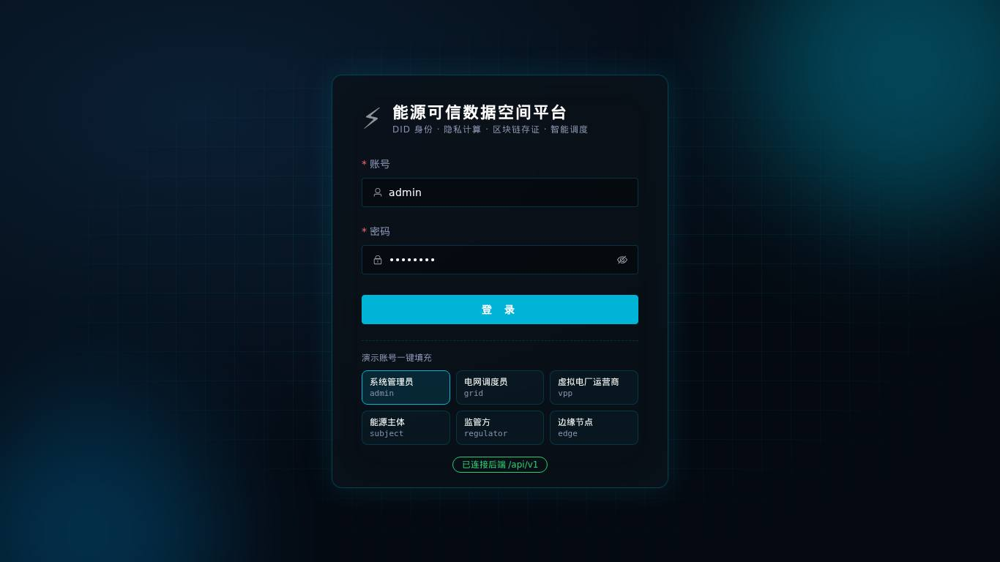

1. 打开系统地址，自动跳到 `/login`。
2. 在「账号」「密码」输入框填写，或在「演示账号一键填充」区点击任一角色按钮（显示角色中文与用户名）自动填充。
3. 点击「登 录」（登录中显示「身份校验中…」）。
4. 成功：跳转到该角色默认首页（见 1.4），页头右侧显示姓名与角色标签（如「系统管理员」）。
5. 失败提示（页面顶部红色 toast，文本来自后端 `message`）：

| 场景 | 提示 |
|---|---|
| 用户名或密码错误 | `用户名或密码错误`（HTTP 401，code 1002） |
| 同一账号 5 分钟内错 5 次 | `密码连续错误 5 次，账号已临时锁定，请 5 分钟后再试`（code 1007）。解锁：`redis-cli DEL auth:login:fail:<用户名>` |
| 账号被管理员停用 | `账号已被停用`（code 1002） |

接口：`POST /auth/login` → 保存 token（localStorage `energy-tds-token`）→ `GET /auth/me` 取扁平权限列表 → 建立 WebSocket `ws://<host>/ws?token=<jwt>`。Token 有效期 8 小时；过期或失效时任何请求返回 1002，前端提示「登录已失效，请重新登录」并跳回 `/login?redirect=<原路径>`。

### 3.2 通用界面分区

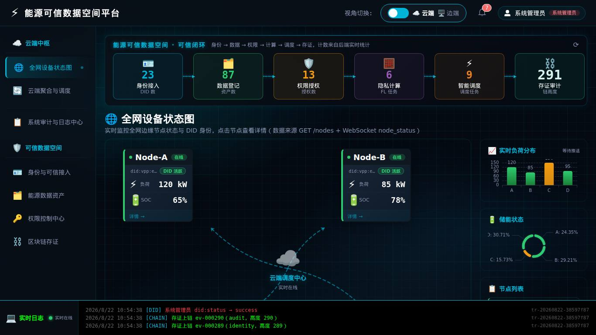

- **页头**：标题「能源可信数据空间平台」；「视角切换：☁️ 云端 / 🖥️ 边端」开关；告警铃铛（未确认告警数角标，点击展开「风险告警」面板：规则码、风险等级、消息、「确认」按钮、「前往审计中心 →」）；用户区（点击展开：DID、「身份中心」、「退出登录」）。
- **左侧菜单**：上段随视角变化——云端中枢：「全网设备状态图」「云端聚合与调度」；边端节点：「选择节点」列表（Node-A～D，带状态点与 DID 状态点）+「本地感知与分级」「动态隐私风险评估」「边缘隐私保护计算」「终端响应与执行」；两种视角都有「系统审计与日志中心」。下段「可信数据空间」固定四项：「身份与可信接入」「能源数据资产」「权限控制中心」「区块链存证」。
- **底部「实时日志」栏**：WebSocket 状态灯（实时在线 / 重连中 / 离线），滚动显示 `log`、`evidence_written`、`audit_alert` 推送与前端操作记录，右侧显示 traceId。

### 3.3 各角色菜单可见性与拦截

| 角色 | 默认首页 | 看不到的菜单 | 进入/操作时的拦截 |
|---|---|---|---|
| admin | 全网设备状态图 | 无 | 无 |
| grid | 全网设备状态图 | 无 | 身份中心「用户管理」页签提示「当前角色无 user:manage 权限」；审计中心各接口返回 1003 |
| vpp | 全网设备状态图 | 无 | 「签名下发」按钮不显示（`v-permission="'dispatch:issue'"`），点「模拟越权下发」得到 1003；审计中心 1003 |
| subject | 全网设备状态图 | 无 | 进入「云端聚合与调度」被路由守卫拦回首页并提示「无权访问「云端聚合与调度」，需要权限 dispatch:read」；「登记资产」按钮隐藏（仅 own 范围写）；审计中心 1003 |
| regulator | 全网设备状态图 | 无 | 可用审计中心；不能登记资产、不能下发 |
| edge | 本地感知与分级 | 「区块链存证」（无 `evidence:read`） | 「创建并启动」FL 按钮置灰（无 `algo:execute`） |

被拒绝时的统一提示（`src/api/request.js`）：

- code **1003**：`越权操作：<后端 message>`，例如 `越权操作：角色 vpp_operator 无 dispatch:issue 权限`。后端同时写 `riskLevel=high`、`result=denied` 审计日志并上链；5 分钟内累计 3 次触发 `R01_UNAUTHORIZED` 告警，管理员铃铛 +1。
- code **1004**：`DID 验签失败：<后端 message>`，例如 `DID 验签失败：签名校验失败`。同样记 high 风险日志。
- 路由级：`无权访问「<页面标题>」，需要权限 <resource:action>`，并跳回首页。

说明：非 `sys_admin`/`regulator` 角色登录后页头铃铛会轮询 `GET /audit/alerts`，后端返回 1003（这属于当前已知差异，会在审计里留下 denied 记录）。

---

## 4. 逐页操作说明

按左侧菜单顺序：云端视角 2 页 → 边端视角 4 页 → 审计 1 页 → 可信数据空间 4 个中心。每页给出用途、分区、操作步骤与预期、涉及接口、常见错误。

### 4.1 全网设备状态图（`/cloud/topology`，云端视角首页）

用途：驾驶舱。顶部「能源可信数据空间 · 可信闭环」横幅六个环节显示实时计数（身份接入 = DID 数、数据登记 = 资产数、权限授权 = 授权数、隐私计算 = FL 任务数、智能调度 = 调度任务数、存证审计 = 链高度），点击任一环节跳到对应页面，右上「⟳」刷新。

分区：中部拓扑图（云端调度中心 + 四个节点卡片：状态、DID 缩写与「DID 活跃」徽章、负荷、SOC、「详情 →」）；下方统计卡（在线节点、总负荷、光伏出力、DID 活跃、告警节点）；右侧「实时负荷分布」「储能状态」「节点列表」。

操作：

1. 点击任一节点卡片或右侧节点列表 → 右侧抽屉显示「DID 身份」（DID、身份状态、最后通信）、「实时数据（metrics）」（当前负荷 / 光伏出力 / 储能功率 / 储能SOC）、「设备信息」（设备型号、已登记资产、所在位置）、「功率趋势（最近 12 小时）」图，底部按钮「🚀 前往云端聚合与调度」。
2. 观察「实时负荷分布」右上「更新 hh:mm:ss」标签随 WebSocket `node_status` 推送刷新（后端每 5 秒一次）。

接口：`GET /nodes`、`GET /nodes/{id}`、`GET /nodes/{id}/metrics?interval=hour`；横幅用 `GET /did?size=1`、`/assets/stats`、`/permissions/grants`、`/fl/tasks?size=1`、`/dispatch/tasks?size=1`、`/evidence/chain/status`；WS `node_status`、`evidence_written`。

常见错误：标签一直「等待推送」→ WebSocket 未连（见 6.4）；横幅某个计数为「--」→ 当前角色无该接口权限（如 edge 无 `evidence:read`）。

### 4.2 云端聚合与调度（`/cloud/aggregate`，需 `dispatch:read`）

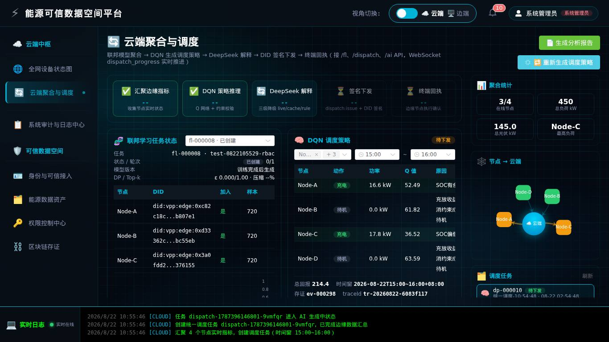

用途：联邦模型聚合状态 → DQN 生成调度策略 → DeepSeek 解释 → DID 签名下发 → 终端回执。

分区：右上按钮「📄 生成分析报告」「🚀 生成调度策略 / 🔁 重新生成调度策略」；顶部阶段条（聚合 → 计算 → 解释 → 签名下发 → 回执，随 WS `dispatch_progress` 推进）；四张卡片：①「联邦学习任务状态」（任务下拉、状态/轮次、模型版本、DP/Top-k、节点表、曲线、「模型版本（GET /fl/models）」列表与「发布」按钮）②「DQN 调度策略」（参与节点多选、开始/结束小时、动作表、总回报、时间窗、存证、traceId、Q 值柱图、「约束校验 constraintsChecked」）③「策略解释与签名下发」（解释来源徽章、解释文本、`signature` 输入框 + 「生成」、「🔏 签名下发」、「🧪 模拟越权下发」）④「AI 智能分析」（提问框、快捷问题、回答/推理/来源/耗时）；右侧「聚合统计」「节点 → 云端」「调度任务」列表、「任务级日志」。

**完整链路：创建 → 运行(DQN) → 签名下发 → 终端回执**

1. 在②卡片选择参与节点（默认全部在线节点）与时间窗（开始/结束小时）。
2. 点「🚀 生成调度策略」：前端依次调 `POST /dispatch/tasks`（创建）→ `POST /dispatch/tasks/{id}/run`（DQN 推理）。预期：几秒内动作表出现每节点「充电 / 待机 / 放电」、功率 kW、Q 值、原因（如「负荷最高，SOC尚可」）；「约束校验」显示 `SOC 20~95% · 单节点 ≤ 30 kW` 与「✅ 全部动作满足约束，无越限修正」或越限修正列表；③卡片出现中文解释，徽章显示「解释来源：DeepSeek 实时」（`live`）或「缓存」「规则」（`cache` / `rule`）；右侧「调度任务」列表出现新任务 `dp-xxxxxx`，状态「待下发」。
3. （可选）④卡片输入「为什么选择节点C放电？」点「提问」→ `POST /ai/analyze`（scene=dispatch），显示 answer、reasoning 列表、来源徽章与 `latencyMs`。
4. **签名下发**（需 `dispatch:issue`，即 admin 或 grid）：点「🔏 签名下发」→ `POST /dispatch/tasks/{id}/issue`，请求体 `{"signature": ...}`。
   - 后端规则：**签名为空**时用签发者 DID 的**托管私钥**代签（种子账号 admin/grid 的 DID 已托管，`custody=true`），再照常验签；签名非空则必须是对 `signPayload`（`dispatch:issue:<taskId>:sm3:<策略摘要>`）的合法 SM2 签名，否则 1004。私钥来源只有两种：身份中心注册 DID / 轮换密钥时**一次性返回**的 `privateKey`，或平台托管密钥（后端 `KEY_CUSTODY_SECRET` 派生的 SM4 密钥加密存储）。
   - 预期：③卡片出现「✅ 指令 cmd-xxxxxx 已下发至 Node-X · 签发者 did:… · 存证 ev-…」，阶段条「签名下发」打勾，WS `dispatch_progress{stage:"issued"}`。
   - **当前已知差异**：前端「生成」按钮产生的 `sig:sha256…` 演示签名不是 SM2 签名，真后端会返回 1004「签名校验失败」并显示红色横幅（见下图）。修复前请用命令行下发（让后端托管代签）：
     ```bash
     curl -s -X POST http://<host>/api/v1/dispatch/tasks/<dp-id>/issue -H "Authorization: Bearer <admin token>" -H 'Content-Type: application/json' -d '{}'
     ```
5. **模拟越权**：任何角色都能看到「🧪 模拟越权下发」，它直接调 issue 接口。用 vpp 登录点击 → 顶部 toast「越权操作：角色 vpp_operator 无 dispatch:issue 权限」，页面出现红色横幅「下发请求已被后端拦截（code 1003）… traceId tr-… · 已写入 high 风险审计日志，管理员将收到 R01 告警」，阶段条「签名下发」标 ❌。记下 traceId 供审计追踪。在 `signature` 框输入 `invalid` 再点「签名下发」可演示 1004。

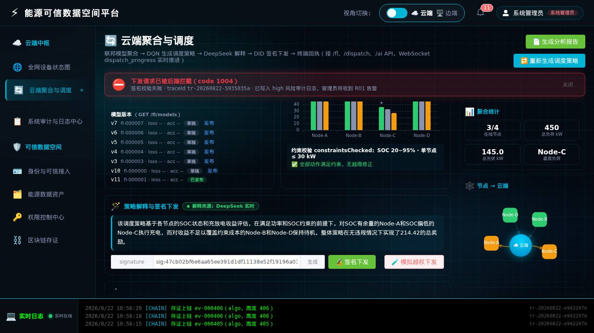

6. **终端回执**：切到边端视角「终端响应与执行」（见 4.6），或命令行 `POST /dispatch/tasks/{id}/ack`，body `{"nodeId":"Node-C","accepted":true}`；任务详情 `ackStatus` 从 `none` → `partial` → `all`。
7. 「📄 生成分析报告」：用本页真实数据拼 Markdown 并下载。
8. 「发布」某个模型版本 → `POST /fl/models/{version}/publish`（需 `algo:execute`）。

接口：`POST/GET /dispatch/tasks`、`/dispatch/tasks/{id}`、`/run`、`/issue`、`/ack`；`GET /fl/tasks`、`/fl/tasks/{id}`、`/fl/models`、`POST /fl/models/{v}/publish`；`POST /ai/analyze`、`GET /ai/history`；WS `dispatch_progress`。

常见错误：`code 2001 算法服务不可用` → algo-service 未起或超时（`ALGO_TIMEOUT=15`），看 6.3；解释来源为「规则」→ DeepSeek key 未配或断网，属正常降级；「重新生成调度策略」后旧任务仍在右侧列表，点击可回看。

### 4.3 本地感知与分级（`/edge/classification`，边端视角首页）

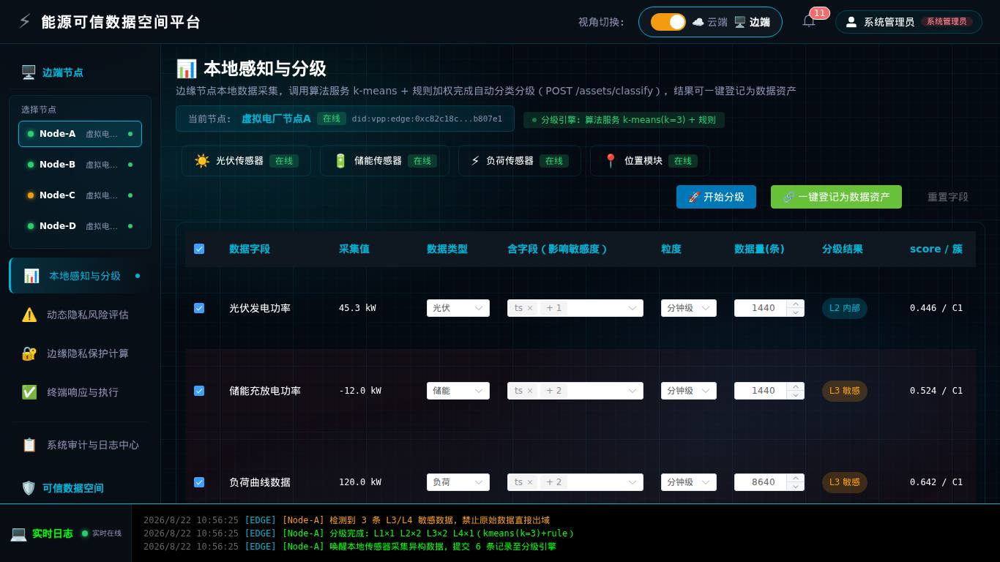

用途：边缘节点把本地采集字段送算法服务做 k-means(k=3) + 规则加权分级，并可一键登记为数据资产。

分区：页头「当前节点」（左侧「选择节点」切换）、「分级引擎：算法服务 k-means(k=3) + 规则」；传感器状态条（光伏/储能/负荷传感器、位置模块）；按钮「🚀 开始分级」「🔗 一键登记为数据资产」「重置字段」；数据表（勾选、数据字段、采集值、数据类型下拉、含字段多选、粒度、数据量、分级结果、score/簇、判定理由、登记）；分级后出现「聚类分析」散点图 + 簇中心、「分级统计」与因子条。

操作：

1. 在表中调整各行「数据类型」「含字段（影响敏感度）」（如加入 `gps`、`userId`）「粒度」「数据量(条)」，取消勾选不参与的行。
2. 点「🚀 开始分级」→ `POST /assets/classify`。预期：每行「分级结果」变为 `L1 公开`～`L4 核心` 徽章，显示 `score / C簇号` 与中文理由；底部散点图与三个簇中心；实时日志出现「分级完成：L1×… L2×…」。
3. 点「🔗 一键登记为数据资产」（需 `asset:write`，edge/admin/vpp 可用）→ 对每行 `POST /assets`，登记列显示 `#资产ID · ev-存证ID`，右侧「✅ 已登记 N 条资产并上链」。
4. 「重置字段」恢复默认。

常见错误：按钮置灰 → 无 `asset:write`；分级一直「分析中...」→ 算法服务不可达（2001）。

### 4.4 动态隐私风险评估（`/edge/risk`）

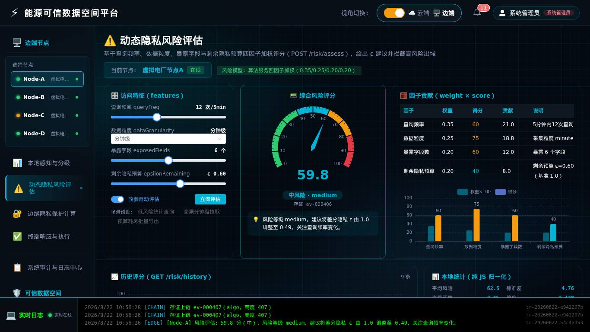

用途：按查询频率 / 数据粒度 / 暴露字段 / 剩余隐私预算四因子（权重 0.35/0.25/0.20/0.20）评分，给出 ε 建议并拦截高风险出域。

操作：

1. 「访问特征（features）」面板拖动「查询频率 queryFreq」（0～30 次/5min）、选择「数据粒度 dataGranularity」、拖动「暴露字段 exposedFields」（0～12）、「剩余隐私预算 epsilonRemaining」（0～1）。
2. 开启「改参自动评估」或点「立即评估」→ `POST /risk/assess`。预期：「综合风险评分」仪表盘显示分数与等级（低/中/高/严重 = low/medium/high/critical）、「存证 ev-…」、「💡 建议…」（如「建议将差分隐私 ε 由 1.0 降至 0.5」）；「因子贡献」表显示权重、得分、贡献；高/严重风险时底部弹出红色「评估结论」横幅（「知道了」关闭）。
3. 「场景预设」三个链接：低风险统计查询 / 高频分钟级拉取 / 预算耗尽批量导出。
4. 「历史评分（GET /risk/history）」折线与「本地统计（纯 JS 归一化）」自动更新。

### 4.5 边缘隐私保护计算（`/edge/privacy`，联邦学习）

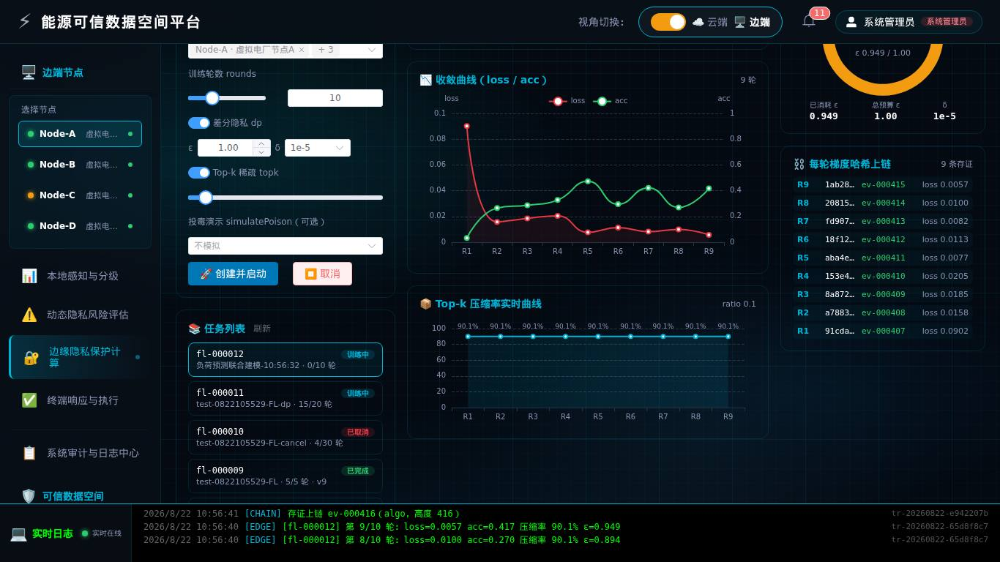

用途：创建并启动联邦学习任务，实时观看收敛曲线、隐私预算消耗、Top-k 压缩率与每轮梯度哈希上链。训练由 algo-service 真算（4 节点 Non-IID 数据，NumPy MLP 8-16-1，FedAvg 按样本量加权）。

**参数含义**

| 字段 | 含义 | 默认 |
|---|---|---|
| 任务名称 | 自定义 | 负荷预测联合建模 |
| 参与节点 nodeIds | 多选，离线节点不可选 | 全部 4 节点 |
| 训练轮数 rounds | 1～30，每轮约 1 秒（`FL_ROUND_DELAY`） | 10 |
| 差分隐私 dp 开关 + **ε** | 隐私预算总量（0.1～10）。ε 越小噪声越大、隐私越强、精度越低。算法：每节点更新 L2 裁剪后，服务端加高斯噪声 `N(0,(σ·C)²)`，σ 由 ε/δ/T 用简化矩会计 `ε = q·√(T·ln(1/δ))/σ` 反推；每轮累计 `epsilonSpent` | 1.00 |
| **δ** | 差分隐私失败概率，可选 1e-3 / 1e-4 / 1e-5 / 1e-6 | 1e-5 |
| Top-k 稀疏 topk 开关 + ratio | 只保留绝对值最大的 k 比例梯度，其余置零并残差缓存；压缩率 = (1 − ratio)×100%。ratio 0.1 → 90% | 0.1 |
| 投毒演示 simulatePoison | 选一个节点让其梯度翻转放大。算法服务用余弦相似度（阈值 −0.5）检测，判为 `gradient_poisoning` 后该节点权重置 0，后端生成 `R05_SUSPICIOUS_GRAD` 高危告警 | 不模拟 |

操作：

1. 填表后点「🚀 创建并启动」（需 `algo:execute`：admin/grid）→ `POST /fl/tasks` + `POST /fl/tasks/{id}/start`。
2. 预期：「数据不出域流程」动画运行，状态「第 n/N 轮训练中」；中间「收敛曲线（loss / acc）」每约 1 秒增加一点（WS `fl_progress`），loss 下降、acc 上升（acc = 相对误差 <10% 的样本占比）；「Top-k 压缩率实时曲线」稳定在 90%；右侧「隐私预算仪表盘」环形进度显示已消耗 ε / 总预算 ε / δ；「每轮梯度哈希上链」列表逐轮出现 `R1 <hash> ev-xxxxxx loss …`；实时日志逐轮打印。
3. 训练结束：状态「已完成」，出现「模型 vN」芯片（`modelVersion`），左侧「任务列表」可点击回看任一历史任务。
4. **异常告警**：
   - 选了「投毒演示」→ 状态卡出现「🚨 检测到异常：可疑梯度上传（Node-X，第 n 轮）」；审计中心「风险告警」出现 `R05`，铃铛 +1。
   - ε 设得很小（如 0.1）→ 预算在中途耗尽，仪表盘变红并提示「预算已超限，任务将被算法服务标记 privacy_budget_exhausted」，训练继续但噪声持续，同样产生 R05。
5. 「⏹ 取消」→ `POST /fl/tasks/{id}/cancel`，状态「已取消」。
6. 页面底部「本地演示：单次差分加噪 & Top-k 稀疏」是浏览器内纯 JS 的教学小工具（调 ε、k，「🎲 重新生成」），不调用后端。

常见错误：「创建并启动」置灰 → 无 `algo:execute`；点击后 `code 2001` → 算法服务未起（训练不可降级，这是预期）；曲线不动 → 看 `docker compose logs algo-service` 与 WebSocket 状态。

### 4.6 终端响应与执行（`/edge/response`）

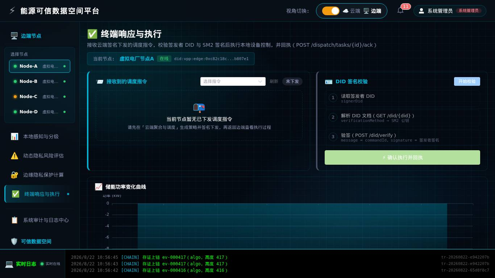

用途：边缘节点接收已签名下发的调度指令，校验签发者 DID 与 SM2 签名，执行并回执。

分区：「接收到的调度指令」（指令下拉、「刷新」、状态芯片、任务/指令编号、下发时间、签发者 DID、traceId、调度动作、目标功率、执行时段、Q 值/原因）；「DID 签名校验」三步（读取签发者 DID → 解析 DID 文档 `GET /did/{did}` → 验签 `POST /did/verify`），按钮「开始校验 / 重新校验」「⚡ 确认执行并回执」；「储能功率变化曲线」；「执行状态对比」；回执结果面板。

操作（在 4.2 第 4 步下发成功后）：

1. 左侧「选择节点」切到指令目标节点（如 Node-C）；若当前节点无指令且存在已下发任务，空态会显示「最新指令目标为 Node-X → 切换到该节点查看」按钮。
2. 在指令下拉选择 `cmd-xxxxxx · 已下发`。
3. 点「开始校验」→ 三步依次打勾，显示「✅ 验签通过：签发者 DID 有效且签名与公钥匹配，允许执行」。
4. 点「⚡ 确认执行并回执」→ 曲线从当前功率过渡到目标功率，随后 `POST /dispatch/tasks/{id}/ack`；出现「执行结果已回执云端并上链」（实际功率、响应时延、回执状态、存证）；云端页阶段条「回执」打勾（WS `dispatch_progress{stage:"acked"}`）。

**当前已知差异**：真后端任务状态按契约枚举保持 `success`，以 `issued: true`/`commandId`/`ackStatus` 标记下发与回执，而本页按 `status === 'issued'` 过滤，因此真后端模式下可能一直显示「当前节点暂无已下发调度指令」。修复前可用命令行回执：

```bash
curl -s -X POST http://<host>/api/v1/dispatch/tasks/<dp-id>/ack -H "Authorization: Bearer <token>" -H 'Content-Type: application/json' -d '{"nodeId":"Node-C","accepted":true}'
```

### 4.7 系统审计与日志中心（`/audit`，仅 sys_admin / regulator 可用接口）

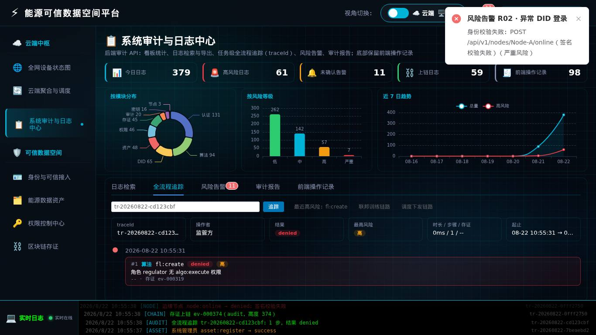

分区：统计卡（今日日志、高风险日志、未确认告警、上链日志、前端操作记录）与三张图（按模块分布、按风险等级、近 7 日趋势），按钮「刷新统计」；五个页签。

**日志检索**：筛选 traceId / actorDid / action（如 `dispatch:issue`）/ riskLevel / 时间范围 / 关键字 → 「查询」「重置」；表格列：时间、traceId、操作者（中文姓名）、模块、动作、结果（success/denied/failed）、风险、详情、存证/hash。点击任一行直接跳到该 traceId 的「全流程追踪」。「导出 CSV」→ `GET /audit/logs/export`（带 BOM 中文表头，文件名 `audit-logs-YYYY-MM-DD.csv`）。

**全流程追踪**：输入 traceId（默认最近一条高风险日志）点「追踪」，或点快捷链接「最近高风险 / 联邦训练链路 / 调度下发链路」→ `GET /audit/trace/{traceId}`。预期：摘要卡（traceId、操作者、结果、最高风险、时长/步骤/存证、起止）与时间轴，每步显示 `#序号 模块 动作 结果 风险 详情 操作者 · 资源 · 存证 ev-…`。

**风险告警**：单选「未确认 / 已确认 / 全部」→ `GET /audit/alerts?status=`；列：时间、规则（R01 越权访问、R02 异常 DID 登录、R03 高频权限变更、R04 批量数据导出、R05 可疑梯度上传）、风险、消息、主体 DID、traceId（可点）、状态、「确认」→ `POST /audit/alerts/{id}/ack`。页头铃铛与此同步。

**审计报告**：选「日报 / 周报 / 月报」与日期，点「生成报告」→ `GET /audit/report?period=&date=`。预期：顶部 `narrative` 中文段落与「叙述来源：DeepSeek 实时 / 缓存 / 规则」徽章；四张卡：身份操作（DID 签发/冻结/注销/密钥轮换）、权限操作（申请/通过/驳回/回收）、存证（总计与按类别）、风险事件（按规则码计数），可能还有「汇总 totals」。

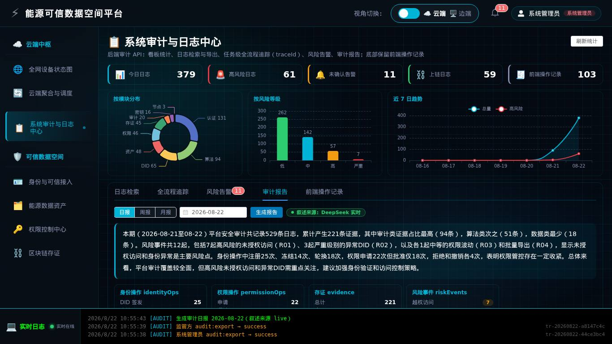

**前端操作记录**：浏览器本地的操作日志（级别/来源筛选、「清空」），traceId 可点。

常见错误：非 admin/regulator 打开本页，统计与列表请求返回 1003 并 toast「越权操作：…」。

### 4.8 身份与可信接入（`/identity`，页面标题「统一身份与可信接入中心」）

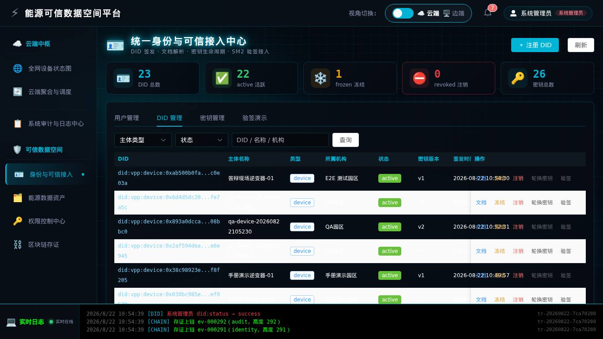

分区：右上「＋ 注册 DID」「刷新」；统计卡「DID 总数 / active 活跃 / frozen 冻结 / revoked 注销 / 密钥总数」（点击按状态筛选）；四个页签。

**用户管理**（仅 `user:manage`，即 admin）：筛选「用户名 / 姓名」「角色」→「查询」；「新建用户」对话框（用户名、密码、姓名、机构、角色多选）→「保存」= `POST /users`；行内「编辑」（可改新密码、角色、状态 正常/禁用）= `PUT /users/{id}`，「删除」= `DELETE /users/{id}`。停用账号即时生效（对方下一次请求 1002「账号已被停用」）。

**DID 管理**：筛选主体类型（user/device/org/edge）、状态、关键字 →「查询」= `GET /did`。行操作：

| 按钮 | 条件 | 接口 | 预期 |
|---|---|---|---|
| 文档 | 总是 | `GET /did/{did}` | 右侧抽屉：DID、类型/状态、控制者、绑定密钥数，`didDocument`（含 `verificationMethod[0].type = SM2VerificationKey2023`、`publicKeyHex`） |
| 冻结 / 解冻 / 注销 | 按状态显示；仅 admin | `POST /did/{did}/status`，`action=freeze/unfreeze/revoke` | 对话框填「原因（将写入存证）」→「确认冻结」；状态标签变化；新存证 |
| 轮换密钥 | active；admin 或 vpp | `POST /did/{did}/rotate-key` | 弹出结果对话框，`密钥版本 v2`，公钥变化，**新私钥仅此一次展示** |
| 验签 | 总是 | — | 跳到「验签演示」页签并带入 DID |

**注册 DID**（admin / vpp）：点「＋ 注册 DID」→ 对话框「注册 DID（签发可信身份）」：主体类型（「用户 user」「设备 device」「机构 org」「边缘 edge」单选）、主体名称（如「光伏逆变器-A01」）、所属机构、元数据（JSON，可空）→「签发并上链」= `POST /did/register`。预期结果对话框（下图）：黄色警告「私钥仅此一次展示，平台不保存明文私钥…」，显示 DID（`did:vpp:device:0x<32hex>`）、公钥（04 开头 130 位 hex）、私钥（64 位 hex）、链上交易 `blk-…`、存证 ID `ev-…`、签发时间，可展开 `didDocument`；按钮「关闭」「去验签演示 →」。首页横幅「身份接入」计数 +1，实时日志出现「签发 device DID …，存证 ev-…」。

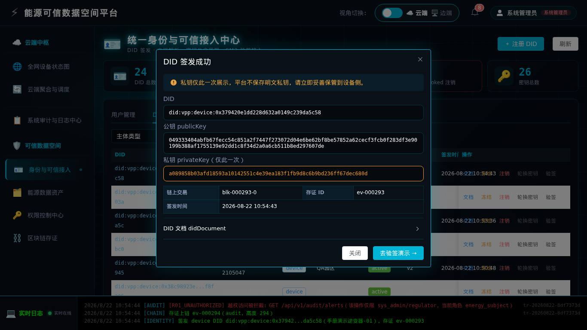

**密钥管理**：按 DID / 状态筛选 = `GET /keys`；「生成并绑定密钥」对话框（DID、算法 SM2/ECC/RSA、有效期(天)）→「生成」= `POST /keys`；行操作「冻结」= `POST /keys/{id}/freeze`、「注销」= `/revoke`（仅 admin）、「轮换历史」= `GET /keys/{id}/history`（时间轴：版本、算法、状态、公钥、由 vN 轮换而来 · 原因 · 操作者）。

**验签演示**：选择/输入 DID、「消息原文 message」、「签名 signature（SM2 签名 hex）」；按钮「使用刚注册的私钥模拟签名」（需本页刚注册/轮换过才可用）、「填入无效签名」、「验 签」= `POST /did/verify`。右侧动画：消息 → SM3 摘要 → SM2 验签 → 结果，显示「✔ 验签通过 valid」或「✘ 验签失败 invalid」及 `subjectType`、`status`、原因（如「身份状态为 frozen，不可用于验签」「签名与公钥不匹配，原文可能被篡改或签名伪造」）。
**当前已知差异**：「使用刚注册的私钥模拟签名」生成的不是真正的 SM2 签名，真后端返回 invalid（见下图）；要得到「验签通过」，请用设备侧真实 SM2 签名，或按 4.2 让后端托管代签后在审计里查看 `did:verify → success`。

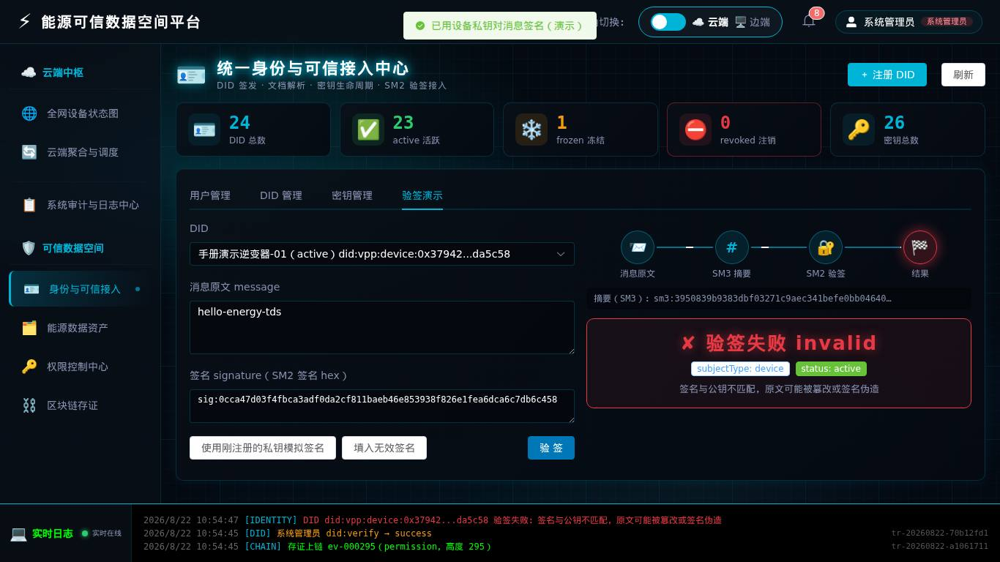

### 4.9 能源数据资产（`/assets`，需 `asset:read`，页面标题「能源数据资产中心」）

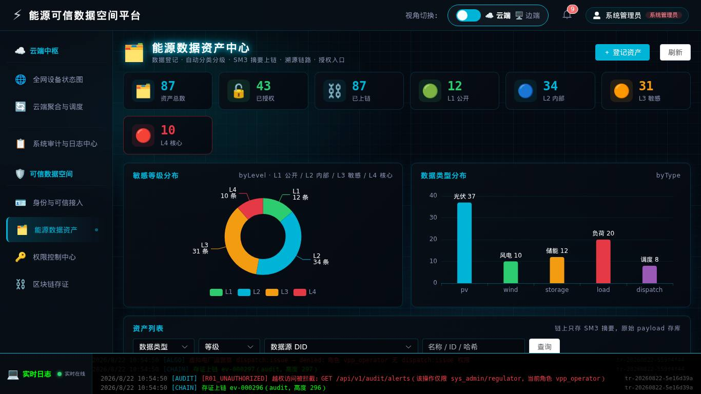

分区：右上「＋ 登记资产」（需 `asset:write`）「刷新」；统计卡（资产总数、已授权、已上链、L1～L4 各数，点击按等级筛选）；「敏感等级分布」饼图、「数据类型分布」柱图（点击筛选）；「资产列表」（筛选数据类型 / 等级 / 数据源 DID / 关键字，列：ID、资产名称、类型、等级、数据源 DID、SM3 摘要、授权、存证、登记时间；行操作「详情」「溯源」「申请授权」）。

**登记资产 → 自动分级 → 上链**

1. 点「＋ 登记资产」→ 对话框「数据资产登记」（左表单 / 右分级结果）。填写：资产名称；数据类型（光伏/风电/储能/负荷/调度）；数据源 DID（下拉，device/edge 类型活跃 DID，默认已选第一项）；采集粒度（秒级～日级）与数据量(条)；payload（JSON，默认示例）；描述；敏感等级（可先不选）。
2. 点「⚙ 自动分级」→ `POST /assets/classify`。预期右侧「分类分级结果」：大号等级徽章、`score`、簇号、中文理由（如「采集粒度为分钟级，数据量较大（1440 条），规则综合敏感度 0.44，聚类簇 1（中敏感簇）」）、雷达图（敏感度/粒度/数据量三因子）、阈值说明「L1 <0.30 ≤ L2 <0.50 ≤ L3 <0.70 ≤ L4」。可手动改级。payload 含 `location`/`gps` 等敏感字段且分钟级、大数据量时通常为 L3/L4。
3. 点「登记并上链」→ `POST /assets`。预期对话框「登记成功 · 已写入存证链」：资产 ID、敏感等级、`sm3:` 摘要、链上交易 `blk-…`、存证 ID `ev-…`、授权状态 `unauthorized`、traceId；按钮「关闭」「查看溯源」「申请授权」。首页横幅「数据登记」+1、「存证审计」+1。

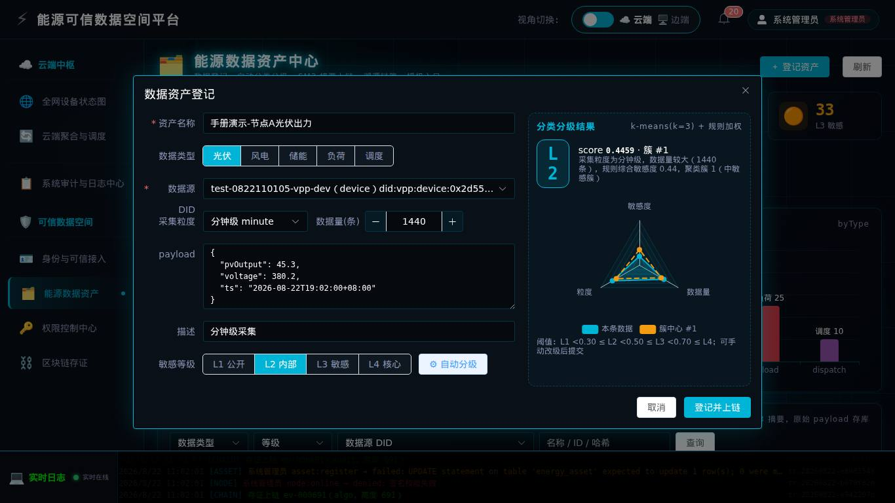

4. 「详情」→ 抽屉：ID/类型、等级、数据源 DID、所有者 DID、SM3 摘要、链上交易/存证、授权状态、描述、登记时间，以及 `payload（原始数据，存 MySQL）`。对应存证（4.11）的 payload 里只有摘要与元信息、没有原始值，这是「数据不出域」的直接证据。
5. 「溯源」→ `GET /assets/{id}/lineage`：抽屉显示 traceId 与四个环节「登记 register / 授权 authorize / 访问 access / 计算 compute」，每个环节列出时间、actor、存证、hash，底部链路图。
6. 「申请授权」→ 对话框（资源 asset/ID、操作 read/write/execute/export、申请理由、有效期至）→「提交申请」= `POST /permissions/apply`，到权限中心审批。

常见错误：subject 看不到「登记资产」（own 范围）；非所有者访问他人资产详情返回 1003；「自动分级」失败 2001 → 算法服务未起（可手动选等级后登记）。

### 4.10 权限控制中心（`/permission`）

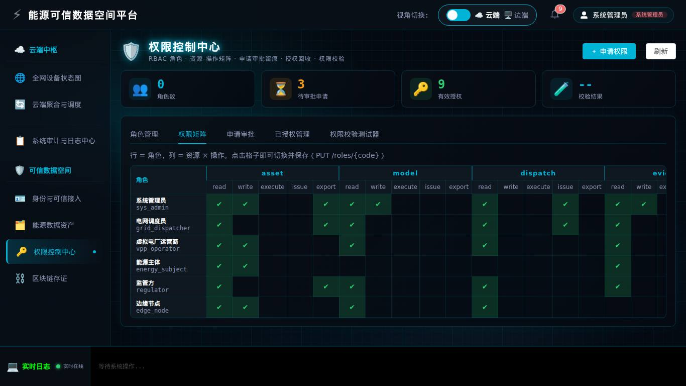

分区：右上「＋ 申请权限」「刷新」；统计卡「角色数 / 待审批申请 / 有效授权 / 校验结果」；五个页签。

**角色管理**：六个内置角色卡片（名称、code、「内置」标签、作用域、权限标签）；admin 可「新建自定义角色」（角色编码、名称、按资源勾选 read/write/execute/issue/export）= `POST /roles`，「编辑授权」= `PUT /roles/{code}`。

**权限矩阵**：行 = 角色，列 = 资源 × 操作，✔ 表示允许 = `GET /permissions/matrix`；admin 点击格子即切换并保存（`PUT /roles/{code}`），其他角色只读。

**申请 → 审批 → 生效 → 审计留痕（完整流程）**

1. 用 **subject** 登录 → 本页「＋ 申请权限」（或资产页行内「申请授权」）：resourceType `asset`、resourceId（资产 ID，如 4.9 刚登记的）、action `read`、理由「用于负荷预测」、有效期至 →「提交」= `POST /permissions/apply`。预期：toast 成功，「申请审批」页签出现 `pending` 记录，存证 `ev-…`；此时 subject 访问该资产详情仍 403（1003）。
2. 用 **admin** 登录 → 「申请审批」页签（或点统计卡「待审批申请」）→ 该行「通过」→ 对话框「审批通过 · 申请 #N」填写审批意见（将写入 `perm_change_log` 与存证）→「通过并生成授权」= `POST /permissions/applications/{id}/approve`。「驳回」= `/reject`。预期：状态变 `approved`，审批意见列显示意见与时间，「已授权管理」页签出现 `active` 授权记录（被授权主体、资源/操作、授权人、授权时间、到期、存证）。首页横幅「权限授权」+1。
3. 回到 **subject**：刷新资产列表，该资产「授权」列变「已授权」，「详情」可打开（HTTP 200）。
4. **回收**：admin 在「已授权管理」点「回收」= `POST /permissions/grants/{id}/revoke` → 状态 `revoked`，subject 立即再次 403。
5. **审计留痕**：审计中心「日志检索」按 action `permission:apply` / `permission:approve` / `permission:revoke` 查询，每条有 traceId、存证、hash；「审计报告」权限操作计数随之变化。

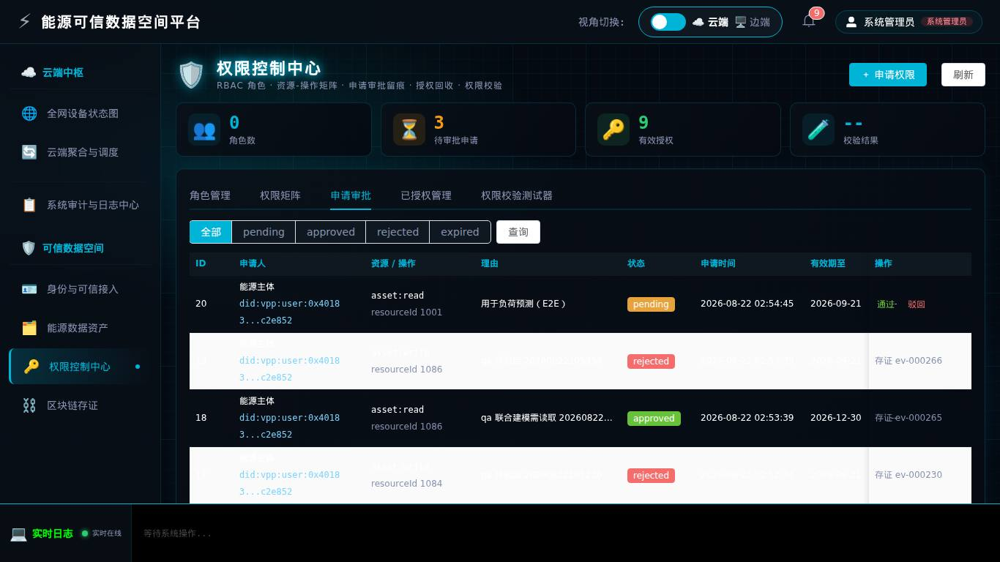

**权限校验测试器**：主体 DID（留空 = 当前用户）、resourceType、resourceId、action →「校 验」= `POST /permissions/check`，显示 `ALLOWED` / `DENIED（已写入审计日志）`、reason（如「角色 vpp_operator 不具备 dispatch:issue 权限」）、matchedRule、资源等级。快捷按钮「一键示例：vpp 尝试 dispatch:issue」「示例：admin 读取 asset 1001」。

### 4.11 区块链存证（`/evidence`，需 `evidence:read`，页面标题「区块链存证中心」）

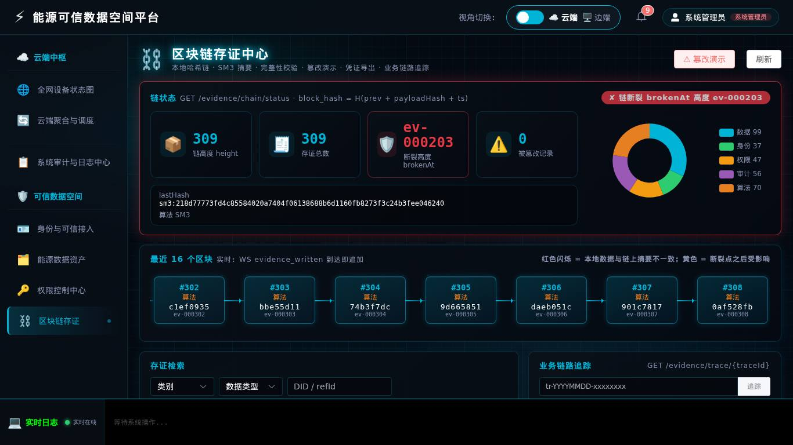

分区：右上「⚠ 篡改演示」（仅 admin）「刷新」；「链状态」面板（链高度 height、存证总数、完整性 INTACT / 断裂高度 brokenAt、被篡改记录数、lastHash、算法 SM3，按类别环图）；「最近 16 个区块」链条（高度、类别、哈希前 8 位、存证 ID，WS `evidence_written` 到达即追加；红色闪烁 = 被篡改，黄色 = 断裂点之后受影响）；「存证检索」表（类别 / 数据类型 / DID 或 refId / 时间范围；列：存证 ID、类别、高度、refId、摘要、actor、时间、状态「完整/篡改」；行操作「详情」「校验」「凭证」）；「业务链路追踪」（输入 traceId →「追踪」= `GET /evidence/trace/{traceId}`）。

**写入**：业务操作自动写入（注册 DID、登记资产、审批、FL 每轮、调度、告警…）；也可 `POST /evidence`（需 `evidence:write`）手工写入，body `{"category":"data","refId":"1001","payload":{...},"actorDid":"did:vpp:..."}`。

**校验**：行内「校验」或详情抽屉「完整性校验」= `POST /evidence/verify`（只传 evidenceId，后端用库内数据重算）。预期对话框「完整性校验结果」：「✔ INTACT 数据完整」（localHash ＝ chainHash）或「✘ TAMPERED 数据已被篡改」（localHash ≠ chainHash，篡改时间，存证与高度）。

**篡改演示（admin）**：

1. 点「⚠ 篡改演示」→ 对话框（黄色说明：直接改写一条 data 类存证的本地快照，链上摘要不变）：目标存证（默认第一条 data 存证）、newValue（默认 `{"pvOutput": 999.9}`）→「执行篡改并校验」= `POST /evidence/demo/tamper`，随后自动调 verify 与 chain/status。
2. 预期：弹出校验结果「✘ TAMPERED」（下图）；关闭后「链状态」面板变红，右上「✘ 链断裂 brokenAt 高度 ev-xxxxxx」，完整性卡显示断裂高度，被篡改记录 1；链条里该块被钉到最前并红色闪烁，之后的块标黄；检索表该行状态「篡改」整行标红；实时日志出现 `evidence:tamper` 与「完整性校验：不一致，已被篡改」。

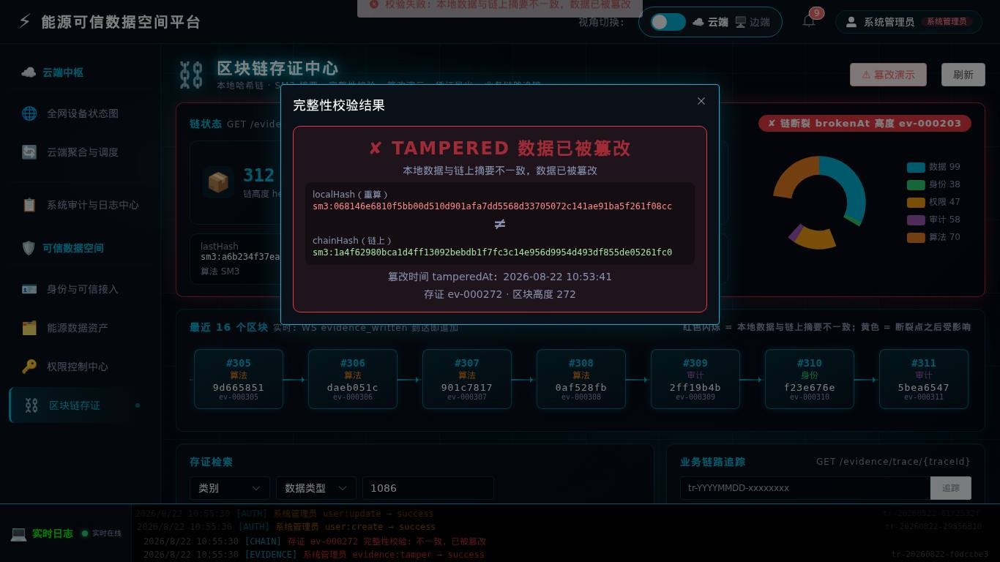

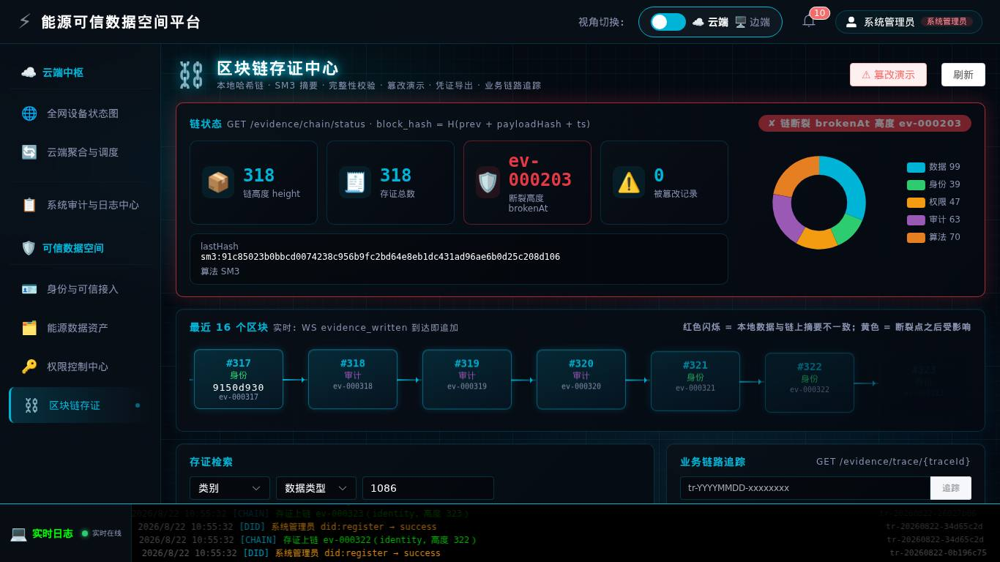

3. **还原**（演示结束务必执行，否则链一直断裂；界面无按钮，用命令行）：
   ```bash
   curl -s -X POST http://<host>/api/v1/evidence/demo/restore -H "Authorization: Bearer <admin token>" -H 'Content-Type: application/json' -d '{"evidenceId":"ev-xxxxxx"}'
   ```
   返回 `restored:true, verification.intact:true`；再点「刷新」，链状态恢复「✔ 链完整 intact」。注意：同一条存证**不要连续篡改两次**，第二次会覆盖 Redis 里的原始备份导致无法自动还原（已记入 `BACKEND-ISSUES.md`）。

**链状态**：`GET /evidence/chain/status`，`height` 应等于 `totalRecords`，`intact:true`、`brokenAt:null`。

**证书下载**：行内「凭证」或详情「导出凭证」= `GET /evidence/{id}/certificate`，浏览器下载 `certificate-ev-xxxxxx.json`，内含 `chainProof`（写明 `SM3(prevHash + payloadHash + timestamp)` 公式与各哈希）与平台机构 DID 的 SM2 `signature`，可离线核验。

**详情**：类别/refId、区块高度/txId、payload 摘要、prevHash、blockHash、actorDid、traceId、时间，`payload 快照（本地库）`，按钮「完整性校验」「导出凭证」「追踪链路」。

---

## 5. 15 分钟端到端演示剧本

与 `deploy/答辩演示剧本.md`（十步版，含话术与 MSW 兜底）一致，这里压缩为 15 分钟、按分钟排。准备：两个浏览器（A 登 admin，B 登 subject/vpp）；`docker compose ps` 全 healthy；`curl localhost/health` 正常；链状态 intact（必要时先 restore）。

| 分钟 | 步骤 | 操作 | 预期 | 讲解要点 |
|---|---|---|---|---|
| 0–1 | 1 登录驾驶舱 | A：登录页点「系统管理员」一键填充 →「登 录」 | 进入「全网设备状态图」，横幅六环节有计数，4 节点在线，右侧「更新 hh:mm:ss」跳动，铃铛有数字 | 六个数字全部来自后端实时统计，接下来每步让其中一个 +1 |
| 1–3 | 2 注册 DID | A：「身份与可信接入」→「＋ 注册 DID」→ 设备 /「答辩现场逆变器-01」/ 机构 →「签发并上链」→ 看结果对话框 →「去验签演示 →」→「填入无效签名」→「验 签」 | DID `did:vpp:device:0x…`，公钥/私钥仅此一次，存证 ev-…；验签演示显示「✘ 验签失败 invalid 签名与公钥不匹配」；横幅「身份接入」+1 | 公钥上链、私钥留设备；伪造签名一眼识破；（真 SM2 签名由设备端产生，演示用无效签名展示拦截） |
| 3–5 | 3 登记资产 | A：「能源数据资产」→「＋ 登记资产」→ 名称「节点A光伏出力-现场」、类型光伏、数据源选刚注册的 DID、payload 加 `"location":{"lat":39.9,"lng":116.4}`、分钟级、1440 条 →「⚙ 自动分级」→「登记并上链」→「查看溯源」 | 分级 L3/L4 + 理由 + 雷达图；登记成功对话框含 `sm3:` 摘要、blk、ev；溯源显示「登记」环节；横幅「数据登记」+1 | 分级是 k-means+规则算出来的；链上只存 SM3 摘要，原始 payload 存库 |
| 5–7 | 4 申请与审批 | B：登 subject →「权限控制中心」→「＋ 申请权限」asset / 刚才的资产 ID / read / 理由 →「提交」。A：「申请审批」→「通过」→ 填意见 →「通过并生成授权」。B：「能源数据资产」刷新 → 该资产「详情」 | B 申请前「详情」403 toast；审批后「已授权管理」出现记录；B 详情可打开；横幅「权限授权」+1 | 申请—审批—生效三步都留痕并存证，权限在后端真实生效 |
| 7–8 | 5 越权拦截 | B：改登 vpp →「云端聚合与调度」→ 右侧「调度任务」点任一已生成策略任务（或点「生成调度策略」）→「🧪 模拟越权下发」 | toast「越权操作：角色 vpp_operator 无 dispatch:issue 权限」，红色横幅 code 1003 + traceId；A 的铃铛 +1（累计 3 次越权触发 R01）；记下 traceId | 网关层拦截、写高危审计、秒级推告警；1003（越权）与 1004（冒名）分得清 |
| 8–10 | 6 联邦学习 | A：切「边端」→「边缘隐私保护计算」→ 保持默认（4 节点、10 轮、ε=1.0、δ=1e-5、Top-k 0.1）→「🚀 创建并启动」 | 曲线每秒长一点，loss 降 acc 升，预算环逐轮增加，压缩率 90%，每轮哈希 + ev；可再建一个任务选「投毒演示 Node-C」看 R05 | 数据不出节点；ε 是会耗尽的量化资源；每轮梯度哈希上链可对账 |
| 10–12 | 7 调度与下发 | A：切「云端」→「云端聚合与调度」→「🚀 生成调度策略」→ 看动作表、约束校验、解释来源徽章 →「提问」→ 下发：终端执行 `curl … /issue -d '{}'`（托管代签，见 4.2）→ 切「边端」→「终端响应与执行」（或 `curl … /ack`） | 策略每节点动作/功率/Q 值；解释中文；下发成功返回 commandId、signerDid；ack 后 `ackStatus` 变化；横幅「智能调度」+1 | DQN 离线训练、边缘推理 <200ms；DeepSeek 翻译 Q 值差；下发必须有权限 + SM2 签名，终端验签后执行回执 |
| 12–13 | 8 防篡改 | A：「区块链存证」→「⚠ 篡改演示」→ 选第 3 步资产的 data 存证 →「执行篡改并校验」 | 「✘ TAMPERED」，链状态变红、brokenAt 指到该存证，链条红/黄标记，该行「篡改」 | 改数据库快照后重算 SM3 对不上，后块含前块哈希所以能指认整段 |
| 13–14 | 9 审计追踪 | A：「系统审计与日志中心」→「全流程追踪」粘贴第 5 步 traceId →「追踪」；「审计报告」→「生成报告」；「日志检索」→「导出 CSV」 | 时间轴显示 denied 高风险步骤与存证；报告含 narrative 与来源徽章；CSV 下载 | 一个 traceId 还原谁、何时、对什么、做了什么、结果如何 |
| 14–15 | 10 断网 | 拔网线 → 再做一次「提问」与「注册 DID」；收尾 `restore` 还原篡改 | AI 解释徽章变「缓存/规则」，内容仍通顺；其他功能正常 | 唯一外部依赖是大模型解释，断网降级且如实标注；所以能装进树莓派 |

应急：后端挂 → 切 MSW 模式（`VITE_USE_MOCK=true npm run dev` 或 `energy-tds/frontend:1.0-mock` 镜像），所有步骤等效可演；详见 `deploy/答辩演示剧本.md`「兜底总则」与「应急速查」。

---

## 6. 运维与排错

### 6.1 服务不健康

```bash
docker compose ps                          # 看哪个不是 healthy
docker compose logs --tail=100 <服务>
curl -s localhost/health                   # backend 根路径探活（deps.mysql / deps.redis）
curl -s localhost/healthz                  # nginx 自身
```

| 现象 | 处理 |
|---|---|
| backend 反复重启、日志 `MySQL 未就绪` | 等 MySQL 首次建库（最长 `DB_WAIT_TIMEOUT=120`s，树莓派可改 300）；`docker compose logs mysql` 看是否 `ready for connections` |
| backend 报 `caching_sha2_password` 需要 cryptography | 本地手工装的 MySQL 8 未切 `mysql_native_password`，执行 2.3 ① 的 `ALTER USER`；compose 版无此问题 |
| 前端 502 | backend 未就绪，nginx 惰性 DNS，backend 起来后自动恢复 |
| 改了 `MYSQL_*` 密码后连不上 | 数据卷仍是旧密码：`docker compose down -v` 后重启（会清库） |
| `/health` 返回 1005 | 访问的是 `/api/v1/health`，该路径不存在；请用根路径 `/health` |

### 6.2 数据库未初始化 / 登录失败

- 症状：登录返回「用户名或密码错误」但账号正确，或 `/users` 为空。
- 检查：`docker compose exec mysql mysql -uenergy -p<MYSQL_PASSWORD> energy_tds -e "SELECT COUNT(*) FROM sys_user; SELECT COUNT(*) FROM chain_evidence;"` 期望 6 与 ≥154。
- 原因：数据卷是旧版本或初始化中断。处理：`docker compose down -v && docker compose up -d`；离线包用 `uninstall.sh --purge` 后重装。
- 种子哈希链自检（纯 SQL）：`SELECT COUNT(*) FROM chain_evidence a JOIN chain_evidence b ON a.block_height=b.block_height+1 WHERE a.prev_hash<>b.block_hash;` 期望 0。

### 6.3 算法服务超时与 DeepSeek 三级降级

- backend 调 algo-service 超时 `ALGO_TIMEOUT=15` 秒；algo 不可达时 FL 启动 / DQN 运行返回 `code 2001 算法服务不可用`（训练无法降级，属预期）；分级、风险评估、AI 解释、审计报告叙述则由 backend 降级为规则化中文（`source=rule`）。
- DeepSeek 在 algo-service 内三级降级：**live**（`DEEPSEEK_API_KEY` 非空，超时 `DEEPSEEK_TIMEOUT=8`s）→ **cache**（`algo-service/cache/deepseek_cache.json`，key = sha256(scene + 上下文 + 问题)，另有按场景兜底 key；`scripts/warm_cache.py` 预热）→ **rule**（中文模板）。永远 200，界面徽章如实标注「DeepSeek 实时 / 缓存 / 规则」。
- 检查：`curl -s localhost:8100/algo/v1/health`（容器内）看 `deepseek: live|cache`；`docker compose logs algo-service | grep -i deepseek`。配置 key 后 `docker compose restart algo-service`。
- 不想等 8 秒超时：先拔网线，或把 `DEEPSEEK_API_KEY` 留空。

### 6.4 WebSocket 未连接

- 底部「实时日志」栏指示灯不是「实时在线」，拓扑页「等待推送」。
- 确认浏览器访问的是 nginx 端口（80）或 Vite 端口，而不是直接访问 8000；nginx 的 `/ws` 已配 `Upgrade` 头与 3600s 超时。
- 鉴权失败关闭码 4001：token 失效，重新登录。
- 前端指数退避自动重连（1s→30s），刷新页面立即重连；30 秒心跳 `{"type":"ping"}`。
- 跨浏览器实时联动（vpp 越权 → admin 铃铛）依赖真后端广播，MSW 模式下不跨标签。

### 6.5 树莓派内存

- 4GB 机型预算：mysql 512M、algo 400M、backend 300M、redis 96M、frontend 64M（compose `deploy.resources.limits`）。
- 用 `packaging/assets/mysql-arm64.cnf`（`performance_schema=OFF`、`innodb_buffer_pool_size=128M`），swap 2GB；`free -m`、`docker stats --no-stream` 观察；backend 稳态 < 200MB。
- 卡顿：关掉右屏日志终端，Chromium 只留一个标签，FL 步骤前再 `docker compose start algo-service`；使用 USB SSD。

### 6.6 密钥与密钥轮换

- **JWT_SECRET**：离线包安装时随机生成；更换后所有已登录 token 失效，重新登录即可。
- **KEY_CUSTODY_SECRET**：托管私钥的 SM4 加密种子，安装后**不可更改**（否则已托管私钥解不开，签名下发会返回 1004「缺少签名，且该身份没有可用的托管密钥」）。
- **DID 密钥轮换**：身份中心「轮换密钥」→ 版本 +1，旧密钥进入历史，新私钥仅此一次返回；冻结 DID 后该身份立即不能验签（Redis `did:status:<did>` 主动删除）。
- **登录锁定解除**：`docker compose exec redis redis-cli DEL auth:login:fail:<用户名>`。

### 6.7 日志位置

| 组件 | 位置 |
|---|---|
| 容器日志 | `docker compose logs -f <backend|algo-service|mysql|redis|frontend>`；离线包 `docker compose -f /opt/energy-tds/docker-compose.yml logs -f` |
| systemd | `journalctl -u energy-tds -f`、`journalctl -u energy-tds-kiosk -f`、`journalctl -u docker -n 50` |
| 开发模式 | uvicorn 标准输出（本联调机 backend 日志在 scratchpad/backend.log）；Vite 终端 |
| 业务审计 | 数据库按月分表 `audit_log_YYYYMM`；界面「系统审计与日志中心」；`GET /audit/logs/export` 导 CSV |

### 6.8 备份与重置

- 备份数据库：`docker compose exec mysql sh -c 'mysqldump -uroot -p"$MYSQL_ROOT_PASSWORD" energy_tds' > backup.sql`；备份 `.env`（离线包在 `/opt/energy-tds/.env`，含随机密钥，丢失则数据卷不可用）。
- 恢复：`docker compose exec -T mysql sh -c 'mysql -uroot -p"$MYSQL_ROOT_PASSWORD" energy_tds' < backup.sql`。
- 重置到种子：`docker compose down -v && docker compose up -d`。
- 只还原篡改演示：`POST /evidence/demo/restore`（4.11）。
- 卷名：`energy-tds-mysql-data`、`energy-tds-redis-data`（`docker volume ls`）。

---

## 7. 附录

### 7.1 接口速查（前缀 `/api/v1`，统一响应 `{code,message,data,traceId}`）

| 模块 | 方法 路径 | 权限要求 |
|---|---|---|
| 认证 | POST /auth/login · POST /auth/logout · GET /auth/me | 登录接口无需 token |
| 用户 | GET/POST /users · PUT/DELETE /users/{id} | 角色 sys_admin |
| DID | POST /did/register | 角色 sys_admin / vpp_operator |
| | GET /did · GET /did/{did} · GET /did/{did}/document · POST /did/verify · POST /did/resolve | 登录即可 |
| | POST /did/{did}/status · POST /did/{did}/rotate-key | status 仅 sys_admin；rotate sys_admin / vpp_operator |
| 密钥 | GET /keys · GET /keys/{id}/history | 登录即可 |
| | POST /keys | sys_admin / vpp_operator |
| | POST /keys/{id}/freeze · /revoke | sys_admin |
| 资产 | POST /assets | asset:write |
| | GET /assets · GET /assets/stats · POST /assets/classify · GET /assets/{id} · GET /assets/{id}/lineage | asset:read（own 范围只能看自有） |
| 权限 | GET /roles · GET /permissions/matrix · POST /permissions/apply · GET /permissions/applications · GET /permissions/grants · POST /permissions/check | 登录即可 |
| | POST /roles · PUT /roles/{code} · POST /permissions/applications/{id}/approve · /reject · POST /permissions/grants/{id}/revoke | sys_admin |
| 存证 | GET /evidence · GET /evidence/{id} · POST /evidence/verify · GET /evidence/chain/status · GET /evidence/trace/{traceId} · GET /evidence/{id}/certificate | evidence:read |
| | POST /evidence | evidence:write |
| | POST /evidence/demo/tamper · POST /evidence/demo/restore | sys_admin |
| 审计 | GET /audit/logs · GET /audit/trace/{traceId} · GET /audit/stats · GET /audit/report · GET /audit/alerts · POST /audit/alerts/{id}/ack · GET /audit/rules · GET /audit/logs/export（CSV 文件流） | sys_admin / regulator |
| 节点 | GET /nodes · GET /nodes/{id} · GET /nodes/{id}/metrics | asset:read |
| | POST /nodes/{id}/online | asset:read + DID 签名（无效 → 1004） |
| 联邦学习 | POST /fl/tasks · POST /fl/tasks/{id}/start · /cancel | algo:execute |
| | GET /fl/tasks · GET /fl/tasks/{id} · GET /fl/tasks/{id}/rounds · GET /fl/models · POST /fl/models/{v}/publish | model:read |
| 调度 | POST /dispatch/tasks · GET /dispatch/tasks · GET /dispatch/tasks/{id} · POST /dispatch/tasks/{id}/ack | dispatch:read |
| | POST /dispatch/tasks/{id}/run | algo:execute |
| | POST /dispatch/tasks/{id}/issue | dispatch:issue + SM2 签名（空签名时托管代签） |
| AI / 风险 | POST /ai/analyze · GET /ai/history · POST /risk/assess · GET /risk/history | asset:read |
| 运维 | GET /health（根路径，不包装，不需登录） | — |
| WebSocket | `ws://<host>/ws?token=<jwt>`，消息类型 node_status / fl_progress / dispatch_progress / audit_alert / log / evidence_written，客户端 `{"type":"ping"}` → `{"type":"pong"}` | 鉴权失败关闭码 4001 |

算法服务内部接口（仅 backend 调用，无鉴权，前缀 `/algo/v1`）：GET /health、POST /fl/train、GET /fl/jobs/{id}、POST /fl/jobs/{id}/cancel、POST /dqn/dispatch、POST /deepseek/analyze、POST /classify、POST /risk/assess。

### 7.2 错误码表

| code | HTTP | 含义 | 界面表现 |
|---|---|---|---|
| 0 | 200 | 成功 | — |
| 1001 | 400 | 参数错误 | toast 后端 message |
| 1002 | 401 | 未登录 / Token 失效 / 账号停用 / 密码错误 | 清登录态并跳 `/login`（登录页原样显示 message） |
| 1003 | 403 | 无权限（RBAC 拒绝） | toast「越权操作：…」，写 high 审计日志并上链 |
| 1004 | 403 | DID 校验失败 / 签名无效 | toast「DID 验签失败：…」，写 high 审计日志 |
| 1005 | 404 | 资源不存在 | toast |
| 1006 | 409 | 状态冲突（重复注册、任务已在运行） | toast |
| 1007 | 429 | 触发风控限流（登录连错 5 次锁 5 分钟） | 登录页显示 message |
| 2001 | 502 | 算法服务不可用 | toast；FL 启动 / DQN 运行失败 |
| 2002 | 502 | 链服务不可用 | toast |
| 5000 | 500 | 服务器内部错误 | toast（不吐堆栈） |

风险规则码：R01_UNAUTHORIZED（越权 ≥3 次/5 分钟）、R02_ABNORMAL_DID（冻结/注销 DID 接入或签名校验失败）、R03_PERM_CHURN（权限变更 ≥5 次/10 分钟）、R04_BULK_EXPORT（单次导出 ≥1000 条或 10 分钟 ≥3 次）、R05_SUSPICIOUS_GRAD（梯度异常 / 隐私预算超限）。

### 7.3 环境变量表

来源：`.env.example`（契约第四部分 + 甲方 `backend/core/config.py` 非契约变量）、`algo-service/config.py`。

| 变量 | 默认值（.env.example） | 读取方 | 说明 |
|---|---|---|---|
| MYSQL_ROOT_PASSWORD | root123 | mysql | 离线包安装时随机生成 |
| MYSQL_DATABASE | energy_tds | mysql / backend | 业务库名 |
| MYSQL_USER | energy | mysql / backend | 业务账号 |
| MYSQL_PASSWORD | energy123 | mysql / backend | 离线包随机生成 |
| MYSQL_HOST | mysql | backend | compose 网络内主机名；开发模式改 127.0.0.1 |
| MYSQL_PORT | 3306 | backend | |
| REDIS_HOST | redis | backend | 开发模式改 127.0.0.1 |
| REDIS_PORT | 6379 | backend | |
| REDIS_DB | 0 | backend | 非契约；Redis 库号（本联调机用 9） |
| BACKEND_PORT | 8000 | backend / compose | 必须保持 8000（Dockerfile 与 nginx 固定） |
| JWT_SECRET | energy-tds-demo-secret-2026 | backend | 离线包随机生成 |
| JWT_ALGORITHM | HS256 | backend | 非契约 |
| JWT_EXPIRE_SECONDS | 28800 | backend | 8 小时 |
| KEY_CUSTODY_SECRET | energy-tds-key-custody-2026 | backend | 非契约；托管私钥 SM4 种子，安装后勿改 |
| ALGO_SERVICE_URL | http://algo-service:8100 | backend | 开发模式改 http://127.0.0.1:8100 |
| ALGO_TIMEOUT | 15.0 | backend | 非契约；调用算法服务超时秒 |
| DEBUG | false | backend | 非契约 |
| DB_WAIT_TIMEOUT | 120 | backend | 非契约；启动等待 MySQL 秒数 |
| ALGO_PORT | 8100 | algo-service | |
| DEEPSEEK_API_KEY | （空） | algo-service | 空 = 跳过 live |
| DEEPSEEK_BASE_URL | 见 .env.example | algo-service | 源码默认空，由 .env 提供 |
| DEEPSEEK_MODEL | deepseek-chat | algo-service | |
| DEEPSEEK_TIMEOUT | 8 | algo-service | 秒，超时即降级 |
| DEEPSEEK_OFFLINE_FALLBACK | true | algo-service | 断网走缓存/规则 |
| FRONTEND_PORT | 80 | compose | 宿主机端口 |
| VITE_API_BASE | /api/v1 | frontend 构建 | |
| VITE_WS_BASE | /ws | frontend 构建 | |
| VITE_USE_MOCK | false | frontend 构建/开发 | true = MSW 离线演示 |

algo-service 仅内部可选变量（`config.py`，均有默认值，需在 shell 或 compose 里导出；compose 已透传 `FL_ROUND_DELAY`）：`DEEPSEEK_CACHE_MAX=2000`、`FL_ROUND_DELAY=1.0`、`FL_LOCAL_EPOCHS=3`、`FL_LOCAL_LR=0.05`、`FL_BATCH_SIZE=32`、`DP_CLIP_NORM=1.0`、`FL_LR_DECAY=0.3`、`POISON_COS_THRESHOLD=-0.5`、`FL_MAX_JOBS=200`、`FL_JOB_TTL=3600`、`FL_MAX_RUNNING=16`；DQN 约束常量 `SOC_MIN=20`、`SOC_MAX=95`、`MAX_POWER_KW=30` 固定在代码中。

### 7.4 截图索引

`docs/screenshots/`：01 登录、02 首页驾驶舱、03 DID 管理、04 注册结果、05 验签演示、06 资产中心、07 登记与分级、08 权限矩阵、09 申请审批、10 存证中心、11 篡改校验、12 链断裂、14 审计追踪、15 审计报告、16 调度策略、17 下发 1004 横幅、18 本地分级、19 风险评估、20 联邦学习、21 终端响应。
